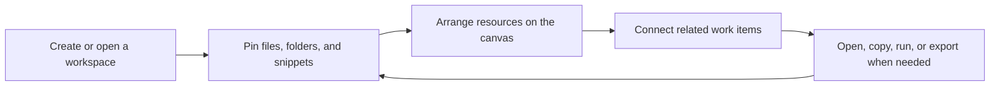

# MyDesk

> A native macOS workbench for turning scattered project files, folders, snippets, and visual relationships into one focused desktop command center.


## Overview

MyDesk is a complete personal productivity workspace for macOS. It helps people who work across many projects keep their folders, files, notes, commands, and visual relationships organized in one calm, native desktop app.

Instead of forcing every project into a plain file tree or a long notes document, MyDesk gives each workspace a structured home: a dashboard, pinned resources, reusable snippets, searchable libraries, and a canvas for mapping how the work fits together.

> [!TIP]
> MyDesk is built for returning to work quickly. Open the app, choose a workspace, and immediately see the files, folders, snippets, and relationships that matter.

## Product Experience

| Area | Experience |
| --- | --- |
| 🏠 Home | A clean starting point for active workspaces and recently used context. |
| 📌 Pinned Resources | Keep important folders and files close, with custom names and quick path actions. |
| 🗂 Global Library | Maintain a reusable resource library that is available across workspaces. |
| ✍️ Snippet Library | Save commands, notes, text blocks, and operational references for repeated work. |
| 🧭 Workspace Canvas | Arrange project resources visually, connect related items, group them into frames, and zoom through the workspace. |
| 🔄 Import / Export | Move workspace data through a structured JSON manifest when you need portability or backup. |
| 🖥 macOS Integration | Open Finder locations, reveal files, and support Terminal-oriented workflows from inside the app. |

## Designed For

| User Need | How MyDesk Helps |
| --- | --- |
| Research projects | Keep papers, datasets, scripts, notes, and output folders together. |
| Creative production | Organize assets, references, drafts, exports, and reusable instructions. |
| Development work | Pin repositories, commands, snippets, specs, and related files around a workspace canvas. |
| Daily operations | Keep frequently used folders, files, and terminal commands within reach. |

> [!IMPORTANT]
> MyDesk stores local app data with SwiftData. Generated build artifacts, local Codex metadata, and app bundles are intentionally ignored by Git.

## Capabilities

| Capability | Details |
| --- | --- |
| Workspace Management | Create, rename, delete, pin, sort, and reopen workspaces. |
| Resource Management | Pin files and folders, preserve original names, add custom display names, copy paths, and route Finder actions correctly. |
| Canvas System | Drop placement, auto-arrange, zoom scaling, visible edge anchors, arrow rendering, animated relationship flow, frames, and grouped movement. |
| Snippets | Store reusable text and command assets with metadata and workspace scope. |
| Data Portability | Export and import schema-versioned workspace manifests with compatibility for older records. |
| Core Reliability | Core ordering, layout, export, shell quoting, and Finder routing logic are covered by XCTest. |

## Product Workflow



## Tech Stack

| Layer | Technology |
| --- | --- |
| App UI | SwiftUI |
| Persistence | SwiftData |
| Package System | Swift Package Manager |
| Core Logic | `MyDeskCore` library target |
| Tests | XCTest |
| Platform | macOS 14+ |

## Requirements

- macOS 14 or newer

For downloading a release build, macOS 14 or newer is enough. Building from source also requires:

- Xcode command line tools
- Swift 6 toolchain

## Install

Download the latest release from the [GitHub Releases page](https://github.com/QiushanHuang/MyDesk/releases).

Use the `.dmg` package for the normal macOS install path:

1. Open `MyDesk-v1.0.0-macOS.dmg`.
2. Drag `MyDesk.app` to `Applications`.
3. Launch `MyDesk` from Applications.

The current public build is ad-hoc signed but not notarized because no Developer ID certificate is configured for this repository yet. If macOS blocks the first launch, right-click `MyDesk.app`, choose **Open**, or allow it in **System Settings > Privacy & Security**.

## Build & Run

Build the package:

```bash
swift build
```

Run the test suite:

```bash
swift test
```

Build and launch the app bundle:

```bash
./script/build_and_run.sh
```

The helper script builds the package, creates `dist/MyDesk.app`, copies the app icon, writes a minimal `Info.plist`, and launches the app.

Create release artifacts:

```bash
./script/package_release.sh
```

The release script creates a versioned ZIP, DMG, install notes, release notes, and SHA-256 checksums under `dist/release/`.

## Project Structure

```text
Sources/MyDesk/       macOS SwiftUI application target
Sources/MyDeskCore/   testable core models, layout, export, and utility logic
Tests/                XCTest coverage for core behavior
docs/                 design notes and implementation plans
script/               local build and run helpers
```

## Roadmap

| Theme | Direction |
| --- | --- |
| Workspace Intelligence | Smarter filtering, richer workspace summaries, and faster switching between project contexts. |
| Canvas Productivity | More layout controls, clearer grouping behavior, and richer visual relationships. |
| Resource Operations | More direct actions for files, folders, snippets, and terminal workflows. |
| Packaging | More polished distribution flow for local installation and release builds. |

## Contributor

Built and maintained by **Qiushan Huang**.

- GitHub: [@QiushanHuang](https://github.com/QiushanHuang)
- Role: Product contributor, designer, and developer

## License

MyDesk is released under the [MIT License](LICENSE).
