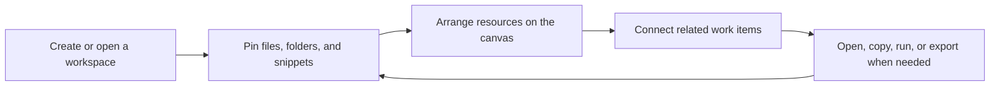

# MyDesk

> A native macOS workbench for turning scattered project files, folders, snippets, and visual relationships into one focused desktop command center.


## Product Vision

MyDesk is designed as a complete personal productivity product for people who work across many files, folders, notes, commands, and project contexts every day.

Instead of forcing everything into a file tree or a notes app, MyDesk gives each workspace a living surface: pinned resources, reusable snippets, searchable libraries, and a visual canvas that shows how things relate.

> [!TIP]
> MyDesk is not just a launcher. It is a project operating surface: organize, open, connect, export, and return to active work without rebuilding context each time.

## What It Does

| Area | Product Experience | Why It Matters |
| --- | --- | --- |
| 🏠 Home | A central dashboard for active workspaces and recent context. | Start from the work, not from scattered folders. |
| 📌 Pinned Resources | Dedicated pinned folders and files with custom names and quick actions. | Keep important materials one click away. |
| 🗂 Global Library | A reusable library of files, folders, and references across workspaces. | Separate permanent resources from temporary workspace shortcuts. |
| ✍️ Snippet Library | Store reusable commands, text snippets, notes, and operational references. | Reduce repeated typing and preserve personal workflow knowledge. |
| 🧭 Workspace Canvas | Arrange resources visually, connect related items, frame groups, and zoom around the workspace. | Make project structure visible instead of buried in lists. |
| 🔄 Import / Export | Move workspace data through a structured JSON manifest. | Keep your work portable and recoverable. |
| 🖥 macOS Integration | Open Finder locations, reveal files, and run Terminal-oriented workflows. | Fit naturally into the desktop workflow. |

## Core Product Modules

| Module | Included Capabilities |
| --- | --- |
| Workspace Management | Create, rename, delete, pin, sort, and reopen workspaces. |
| Resource Management | Pin files and folders, preserve original names, add custom display names, copy paths, and route Finder actions correctly. |
| Canvas System | Drop placement, auto-arrange, zoom scaling, visible edge anchors, arrow rendering, animated relationship flow, frames, and grouped movement. |
| Snippets | Store reusable text and command assets with metadata and workspace scope. |
| Data Portability | Schema-versioned export manifest with backward-compatible decoding for older records. |
| Reliability Layer | Unit-tested ordering, shell quoting, manifest round trips, canvas geometry, and Finder routing behavior. |

> [!IMPORTANT]
> MyDesk stores local app data with SwiftData and keeps generated artifacts out of version control. Build outputs, local Codex metadata, and app bundles are intentionally ignored.

## Product Workflow



## Why MyDesk Feels Like a Product

- **Native first**: built as a macOS app with SwiftUI instead of a wrapped web page.
- **Data-aware**: SwiftData-backed models for workspaces, pins, snippets, canvases, nodes, edges, and Finder aliases.
- **Portable**: import and export use a structured manifest rather than opaque local-only state.
- **Tested core**: behavior that should not regress lives in `MyDeskCore` with focused XCTest coverage.
- **Workflow-centered**: the UI is organized around repeated daily actions: find, open, copy, connect, and resume.

## Tech Stack

| Layer | Technology |
| --- | --- |
| App UI | SwiftUI |
| Persistence | SwiftData |
| Package System | Swift Package Manager |
| Core Logic | `MyDeskCore` library target |
| Tests | XCTest |
| Platform | macOS 14+ |

## Requirements

- macOS 14 or newer
- Xcode command line tools
- Swift 6 toolchain

## Build & Run

Build the package:

```bash
swift build
```

Run the test suite:

```bash
swift test
```

Build and launch the app bundle:

```bash
./script/build_and_run.sh
```

The helper script builds the package, creates `dist/MyDesk.app`, copies the app icon, writes a minimal `Info.plist`, and launches the app.

## Project Structure

```text
Sources/MyDesk/       macOS SwiftUI application target
Sources/MyDeskCore/   testable core models, layout, export, and utility logic
Tests/                XCTest coverage for core behavior
docs/                 design notes and implementation plans
script/               local build and run helpers
```

## Quality Snapshot

| Check | Status |
| --- | --- |
| Swift package build | ✅ Supported |
| Core unit tests | ✅ 28 passing tests |
| Manifest round trip | ✅ Covered |
| Canvas geometry | ✅ Covered |
| Shell quoting | ✅ Covered |
| Finder routing | ✅ Covered |

## Roadmap

| Theme | Direction |
| --- | --- |
| Workspace Intelligence | Smarter filtering, richer workspace summaries, and faster switching between project contexts. |
| Canvas Productivity | More layout controls, clearer grouping behavior, and richer visual relationships. |
| Resource Operations | More direct actions for files, folders, snippets, and terminal workflows. |
| Packaging | More polished distribution flow for local installation and release builds. |

## Contributor

Built and maintained by **Qiushan Huang**.

- GitHub: [@QiushanHuang](https://github.com/QiushanHuang)
- Role: Product contributor, designer, and developer

## License

No license has been declared yet. Add a license before distributing or accepting external contributions.
